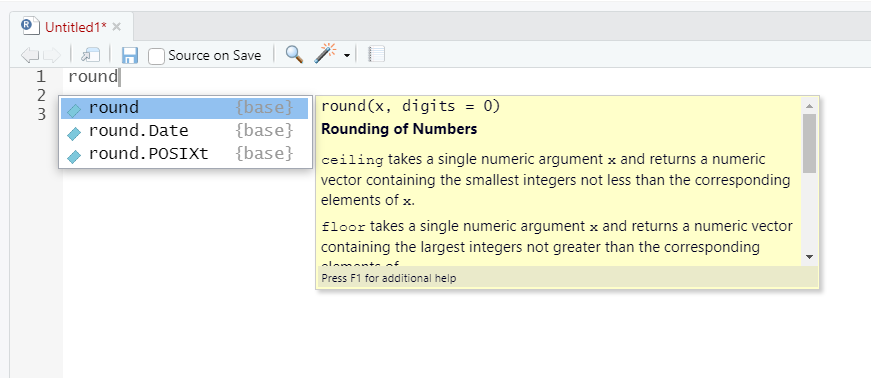

# Homework A1

### HA1 Instructions

Read this tutorial and apply the codes in R.

### Rules & conventions for naming variables

Variable names (`sales` and `revenue`) have just been English-language words written using lowercase letters. However, R allows a lot more flexibility when it comes to naming variables:

* Variable names can take any upper case, lower case, or numeric characters, as well as period and underscore characters.&#x20;
* Variable names cannot include spaces: therefore `my sales` is not valid.
* Variable names are case sensitive: that is, `Sales` and `sales` are _different_ variable names.
* Variable names must start with a letter or, for special purposes, a period.
* Variable names cannot be one of the reserved keywords: `if`, `else`, `repeat`, `while`, `function`, `for`, `in`, `next`, `break`, `TRUE`, `FALSE`, `NULL`, `Inf`, `NaN`, `NA`, `NA_integer_`, `NA_real_`, `NA_complex_`, and finally, `NA_character_`.&#x20;

You aren’t obliged to follow these conventions, but it’s generally a good idea to follow them:

* Use informative variable names. As a general rule, using meaningful names like `sales` and `revenue` is preferred over arbitrary ones like `variable1` and `variable2`.
* Use short variable names. So we much prefer to use a name like `sales` over a name like `sales.for.this.book.that.you.are.reading`.&#x20;
* Conventional naming styles for multi-word variables include separating words using periods, like `my.new.salary` or underscores, like `my_new_salary`.&#x20;

### Using functions in calculations

The symbols `+`, `-`, `*` and so on are examples of operators. However, in order to do more advanced calculations and statistical operations, you’re going to need functions. To get started, suppose I wanted to take the square root of 225. Since the square root of 255 is the same thing as raising 225 to the power of 0.5, I could use the power operator `^`, just like we did earlier:

```
> 225 ^ 0.5
[1] 15
```

However, there’s a second way that we can do this, since R also provides the **square root function**, `sqrt()`. To calculate the square root of 255 using this function, what I do is insert the number `225` in the parentheses:

```
> sqrt(225)
[1] 15
```

&#x20;When we use a function to do something, we generally refer to this as **calling** the function, and the values that we type into the function (there can be more than one) are referred to as the **arguments** of that function. One function that we will need to use is the **absolute value function**. Compared to the square root function, it’s extremely simple: it just converts negative numbers to positive numbers and leaves positive numbers alone. R provides the function `abs()` for this purpose:

```
> abs(-21)
[1] 21
```

R allows us to put functions together and even combine functions with operators:

```
> sqrt(1 + abs(-8))
[1] 3
```

### Function arguments, names, and defaults

There are two more fairly important things about functions: named arguments, and default values for arguments. To understand what these two concepts are all about, let's use the function `round()` to round some value to the nearest whole number:

```
> round(3.1415)
[1] 3
```

Suppose you only wanted to round it to two decimal places, which is `3.14` . The function `round()` supports this, by allowing you to input a second argument to the function that specifies the number of decimal places that you want to round the number to:

```
> round(3.14165, 2)
[1] 3.14
```

What’s happening here is that we’ve specified _two_ arguments: the first argument is the number that needs to be rounded, and the second argument is the number of decimal places that it should be rounded to, and the two arguments are separated by a comma. In this simple example, it’s quite easy to remember which argument comes first and which one comes second, but for more complicated functions this is not easy. Most R functions make use of **argument names**. For the `round()` function, the number that needs to be rounded is specified using the argument `x` , and the number of decimal points that you want it rounded to is specified using the argument `digits`:

```
> round(x = 3.1415, digits = 2)
[1] 3.14
```

Specifying the arguments by name involves more typing, but it’s easier to read and safer because it doesn’t matter what order you type them in. But if you don’t use the argument names, then you have to input the arguments in the correct order:

```
> round(digits = 2, x = 3.1415)
[1] 3.14
```

The second thing you need to know about is **default values**. Notice that the first time we called the `round()` function we didn’t actually specify the `digits` argument at all, and yet R somehow knew that this meant it should round to the nearest whole number. How did that happen? The answer is that the `digits` argument has a default value of `0`. This is quite handy: the vast majority of the time when you want to round a number you want to round it to the nearest whole number, and it would be pretty annoying to have to specify the `digits` argument every single time.

### RStudio's help with commands

There are a _lot_ of R functions, all of which have their own arguments. You’re probably also worried that you’re going to have to remember all of them! Thankfully, it’s not that bad. In fact, very few data analysts bother to try to remember all the commands. What they really do is use tricks to make their lives easier. The first is to use the internet. If you don’t know how a particular R function works, Google it. Second, you can look up the R help documentation. Third, there are simple tricks that RStudio makes available as follows.

The first thing is the autocomplete ability in RStudio. Start typing the name of the function that you want. RStudio will then display a little window like the one shown in **Figure HA1.1**. The window has two panels. On the left, there’s a list of variables and functions that start with the typed letters, and some grey text that tells you in which package the variable/function is stored. The panel on the right displays information about the `round()` function. You can see that there are a few things that start with the typed letters. You can use the up and down arrow keys to select the one that you want and hit the Tab or the Enter key. Or, if none of the options look right to you, you can hit the Escape key to make the window go away.

<figure><figcaption><p><strong>Figure HA1.1</strong> RStudio autocomplete</p></figcaption></figure>

### Command history

R automatically keeps track of your command history. The simplest way is to use the up and down arrow keys in the R console. The second way to get access to your command history is to look at the history panel in RStudio. If you double-click on one of the commands, it will be copied to the R console.

### Storing numbers as a vector

In R, the name for a variable that can store multiple values is a **vector**. So let’s create one. Let’s stick to the textbook example. Suppose the textbook company sends you sales data on a monthly basis. Let’s suppose there were 100 sales in February, 200 sales in March and 50 sales in April, and no other sales for the rest of the year. What we would like is `sales.by.month`. The first number stored should be `0` since there were no sales in January and the second should be `100`. The way to do this in R is to use the **combine** function `c()` and type the numbers in a comma-separated list:

```
> sales.by.month <- c(0, 100, 200, 50, 0, 0, 0, 0, 0, 0, 0, 0)
> sales.by.month
[1]   0 100 200  50   0   0   0   0   0   0   0   0
```

To use the correct terminology here, we have a single variable called `sales.by.month`, a vector that consists of 12 **elements**. Now, the next thing to understand is how to pull that information back out again. Suppose we want to pull out the February sales data only. February is the second month of the year, so let’s try this:

```
> sales.by.month[2]
[1] 100
```

Notice that the output is `[1] 100`, not `[2] 100`. This is because R is extremely literal. When we typed `sales.by.month[2]`, we asked R to find exactly _one_ thing, and that one thing happens to be the second element of our `sales.by.month` vector. To store the February sales, we could create the variable `february.sales` :

```
> february.sales <- sales.by.month[2]
> february.sales
[1] 100
```

### Working with vectors

Sometimes you’ll want to change the values stored in a vector. One possibility would be to assign the whole vector again from the beginning, using `c()`. But that’s a lot of typing. Also, it’s a little wasteful: why should R have to redefine the sales figures for all 12 months, when only the 5th one is wrong? Fortunately, we can tell R to change only the 5th element, using this trick:

```
> sales.by.month[5] <- 25
> sales.by.month
[1]   0 100 200  50  25   0   0   0   0   0   0   0
```

Another way to edit variables is to use the `edit()` or `fix()` functions.

You often find yourself wanting to know how many elements there are in a vector. You can use the `length()` function to do this:

```
> length(x = sales.by.month)
[1] 12
```

Secondly, you often want to alter all of the elements of a vector at once. For instance, suppose you wanted to figure out how much money you made each month. You may want to get $7 per book, thus, what you want to do is multiply each element in the `sales.by.month` vector by 7:

```
> sales.by.month * 7
[1]    0  700 1400  350  175    0    0    0    0    0    0    0
```

In other words, when you multiply a vector by a single number, all elements in the vector get multiplied. The same is true for addition, subtraction, division, and taking powers. Suppose you wanted to know how much money was made per day, rather than per month. Since not every month has the same number of days, you need to do something slightly different:

```
> days.per.month <- c(31, 28, 31, 30, 31, 30, 31, 31, 30, 31, 30, 31)
> profit <- sales.by.month * 7
> profit / days.per.month
[1]  0.000000 25.000000 45.161290 11.666667  5.645161  0.000000  0.000000
[8]  0.000000  0.000000  0.000000  0.000000  0.000000
```

Notice that the second element of the output is 25 because R has divided the second element of `profit` (i.e. 700) by the second element of `days.per.month` (i.e. 28). Similarly, the third element of the output is equal to 1400 divided by 31, and so on.&#x20;

### Storing text data

A lot of the time data will be numeric in nature, but sometimes data really needs to be described using text. To create a variable that stores the word “hello”, we can type this:

```
> greeting <- "hello"
> greeting
[1] "hello"
```

When interpreting this, it’s important to recognize that the quotation marks here aren’t part of the string itself. They just tell R to treat the characters that they enclose are text data, known as a **character string**. In other words, R treats `"hello"` as a string containing the word “hello”; but if you had typed `hello` , R would go looking for a variable by that name! You can also use `'hello'` to specify a character string. Of course, there’s no reason why we can’t create a vector of character strings:

```
months <- c("January", "February", "March", "April", "May", "June",
            "July", "August", "September", "October", "November", 
            "December")
```

This is a **character vector** containing 12 elements, each of which is the name of a month. So if you wanted R to find the name of the fourth month, all you would do is this:

```
> months[4]
[1] "April"
```

So far, most of the functions that we have seen (i.e., `sqrt()`, `abs()` and `round()`) only make sense when applied to numeric data (e.g., you can’t calculate the square root of “hello”), and we’ve seen one function that can be applied to pretty much any variable or vector (i.e., `length()`). The function `nchar()` counts the number of individual characters that make up a string.&#x20;

```
> nchar(x = greeting)
[1] 5
```

That makes sense, since there are in fact 5 letters in the string `"hello"`. Better yet, you can apply `nchar()` to whole vectors: So, for instance, to ask R how many letters there are in the names of each of the 12 months:

```
> nchar(x = months)
[1] 7 8 5 5 3 4 4 6 9 7 8 8
```

### Storing “true or false” data

A key concept in R is the idea of a **logical value**. A logical value is an assertion about whether something is true or false. This is implemented in R in a pretty straightforward way. There are two logical values, namely `TRUE` and `FALSE`. If you want R to make an explicit judgement, you can use a command like this:

```
> 2 + 2 == 4
[1] TRUE
> 2 + 2 == 5
[1] FALSE
```

What we’ve done here is use the **equality operator** `==` to force R to make a “true or false” judgment. You probably won’t be surprised to discover that we can combine logical operations with other operations and functions in a more complicated way, like this:

```
> 3*3 + 4*4 == 5*5
[1] TRUE
```

There are several other logical operators that you can use, corresponding to some basic mathematical concepts.

| operation                | operator | example input    | answer  |
| ------------------------ | -------- | ---------------- | ------- |
| less than                | <        | 2 < 3            | `TRUE`  |
| less than or equal to    | <=       | 2 <= 2           | `TRUE`  |
| greater than             | >        | 2 > 3            | `FALSE` |
| greater than or equal to | >=       | 2 >= 2           | `TRUE`  |
| equal to                 | ==       | 2 == 3           | `FALSE` |
| not equal to             | !=       | 2 != 3           | `TRUE`  |
| not                      | !        | !(1==1)          | `FALSE` |
| or                       | \|       | (1==1) \| (2==3) | `TRUE`  |
| and                      | &        | (1==1) & (2==3)  | `FALSE` |

For instance, if we ask R to assess the claim that “either $$2+2=4$$ _or_ $$2+2=5$$” R would say that it’s true. Since it’s an “either-or” statement, all we need is for one of the two parts to be true. That’s what the `|` operator does:

```
> (2+2 == 4) | (2+2 == 5)
[1] TRUE
```

On the other hand, if we ask R to assess the claim that “both $$2+2=4$$ _and_ $$2+2=5$$” R would say that it’s false. Since this is an _and_ statement we need both parts to be true. And that’s what the `&` operator does:

```
> (2+2 == 4) & (2+2 == 5)
[1] FALSE
```

Finally, there’s the _not_ operator, which is simple but annoying to describe in English. If we ask R to assess the claim that “it is not true that $$2+2=5$$”:

```
> ! (2+2 == 5)
[1] TRUE
> 2+2 != 5
[1] TRUE
```

Up to this point, we’ve seen _numeric data_ and _character data_. So you might not be surprised to discover that these `TRUE` and `FALSE` values that R has been producing are actually a third kind of data, called _logical data_. When asking R if `2 + 2 == 5` it says `[1] FALSE` in reply, which is information that we can store in variables. For instance, we could create a variable called `two.plus.two.equals.five` which would store R’s opinion:

```
> two.plus.two.equals.five <- 2 + 2 == 5
> two.plus.two.equals.five
[1] FALSE
> two.plus.two.equals.five <- FALSE
> two.plus.two.equals.five
[1] FALSE
```

Better yet, because it’s kind of tedious to type `TRUE` or `FALSE` over and over again, R provides you with the case-sensitive shortcuts `T` and `F` :

```
> two.plus.two.equals.five <- F
> two.plus.two.equals.five
[1] FALSE
```

### Vectors of logical data

You can store vectors of logical values in the same way that you can store vectors of numbers and text data:

```
> x <- c(TRUE, TRUE, FALSE)
> x
[1]  TRUE  TRUE FALSE
```

We could use the `sales.by.month` vector and ask R whether any books were sold each month:

```
> sales.by.month > 0
[1] FALSE  TRUE  TRUE  TRUE  TRUE FALSE FALSE FALSE FALSE FALSE FALSE
[12] FALSE
> any.sales.this.month <- sales.by.month > 0
any.sales.this.month
[1] FALSE  TRUE  TRUE  TRUE  TRUE FALSE FALSE FALSE FALSE FALSE FALSE
[12] FALSE
```

In other words, `any.sales.this.month` is a logical vector whose elements are `TRUE` only if the corresponding element of `sales.by.month` is greater than zero.

### Applying logical operation to text

We can ask R if the word `"cat"` is the same as the word `"dog"`, like this:

```
"cat" == "dog"
[1] FALSE
"cat" == "cat"
[1] TRUE
```

R is not at all tolerant when it comes to grammar and spacing. If two strings differ in any way whatsoever, R will say that they’re not equal to each other, as the following examples indicate:

```
" cat" == "cat"
[1] FALSE
"cat" == "CAT"
[1] FALSE
"cat" == "c a t"
[1] FALSE
```

### Indexing vectors

So far, whenever we’ve had to get information out of a vector, all we’ve done is typed something like `months[4]` ; and when we do this R prints out the fourth element of the `months` vector. In this section, we’ll see two additional tricks for getting information out of the vector.

One very useful thing we can do is pull out more than one element at a time. Suppose we wanted the data for February, March and April. We could use the vector `c(2,3,4)` to indicate which elements we want R to pull out. Notice that the order matters here.

```
> sales.by.month[c(2,3,4)]
[1] 100 200  50
> sales.by.month[c(4,3,2)]
[1]  50 200 100
```

A second thing to be aware of is that R provides you with handy shortcuts for very common situations. For instance, suppose that we wanted to extract everything from the 2nd month through to the 8th month:

```
> sales.by.month[c(2,3,4,5,6,7,8)]
[1] 100 200  50  25   0   0   0
```

To help make this easier, R lets you use `2:8` as shorthand for `c(2,3,4,5,6,7,8)`, which makes things a lot simpler:

```
> 2:8
[1] 2 3 4 5 6 7 8
> sales.by.month[2:8]
[1] 100 200  50  25   0   0   0
```

At this point, we can introduce an extremely useful tool called **logical indexing**. We created a logical vector `any.sales.this.month`, whose elements are `TRUE` for any month in which at least one book was sold, and `FALSE` for all the others. However, that big long list of `TRUE`s and `FALSE`s is a little bit hard to read, so what we’d like to do is to have R select the names of the `months` for any book was sold. Earlier on, we created a vector `months` that contains the names of each of the months. What we need to do is this:

```
> months[sales.by.month>0]
[1] "February" "March" "April" "May"
```

To understand what’s happening here, it’s helpful to notice that `sales.by.month > 0` is the same logical expression that we used to create the `any.sales.this.month` vector in the last section. In fact, we could have just done this:

```
> months[any.sales.this.month]
[1] "February" "March" "April" "May"
> sales.by.month[sales.by.month > 0]
[1] 100 200  50  25
```

We can do the same thing with text. Suppose that – to continue the saga of the textbook sales – we later find out that the bookshop only had sufficient stocks for a few months of the year. Early in the year they had `"high"` stocks, which then dropped to `"low"` levels, and in fact for one month they were `"out"` of copies of the book for a while before they were able to replenish them. We might have a variable called `stock.levels` which looks like this:

```
> stock.levels<-c("high", "high", "low", "out", "out", "high",
                "high", "high", "high", "high", "high", "high")
> stock.levels
[1] "high" "high" "low"  "out"  "out"  "high" "high" "high" "high" "high"
[11] "high" "high"
```

Thus, if we want to know the months for which the bookshop was out of book, we could apply the logical indexing trick, but with the character vector `stock.levels`, like this:

```
> months[stock.levels == "out"]
[1] "April" "May"
```

Alternatively, if we want to know when the bookshop was either low on copies or out of copies, we could do this:

```
> months[stock.levels == "out" | stock.levels == "low"]
[1] "March" "April" "May"
```

or this

```
months[stock.levels != "high" ]
[1] "March" "April" "May"
```

Either way, we get the answer we want. Logical indexing is a very basic, yet very powerful way to manipulate data. It does take a bit of practice to become completely comfortable using logical indexing, so it’s a good idea to play around with these sorts of commands. Try creating a few different variables of your own, and then ask yourself questions like “how do I get R to spit out all the elements that are \[blah]”. Practice makes perfect, and it’s only by practicing logical indexing that you’ll perfect the art of yelling frustrated insults at your computer.

### Quitting R

<figure><figcaption><p><strong>Figure HA1.2</strong> The RStudio closing dialogbox</p></figcaption></figure>

R has a function, called `q()` that you can use to quit, which is pretty handy if you’re running R in a terminal window. Regardless of what method you use to quit R, when you do so for the first time R will probably ask you if you want to save the “workspace image”. If you’re using RStudio, you’ll see a dialog box that looks like the one shown in **Figure HA1.2**. If you’re using a text based interface you’ll see this:

```
> q()
Save workspace image? [y/n/c]: 
```

The `y/n/c` part here is short for “yes/no/ cancel”. Type `y` if you want to save, `n` if you don’t, and `c` if you’ve changed your mind and you don’t want to quit after all. What does this actually _mean_? t R wants to know if you want to save all those variables that you’ve been creating in a “default” data file, which it will automatically reload for you next time you open R. You can change the settings so that it never asks this again. You can do this in RStudio really easily: use the menu system to find the RStudio option; the dialog box that comes up will give you an option to tell R never to whine about this again. See **Figure HA1.3**. On a Mac, you can open this window by going to the “RStudio” menu and selecting “Preferences”. On a Windows machine you go to the “Tools” menu and select “Global Options”. Under the “General” tab you’ll see an option that reads “Save workspace to .Rdata on exit”. By default this is set to “ask”. If you want R to stop asking, change it to “never”.

<figure><figcaption><p><strong>Figure HA1.3</strong> The RStudio Options window</p></figcaption></figure>

### Comments

The **comment character** `#` has a simple meaning: it tells R to ignore everything else you’ve written on this line. You won’t have much need of the `#` character immediately, but it’s very useful later on when writing scripts. For instance, if you read this:

```
seeker <- 3.1415           # create the first variable
lover <- 2.7183            # create the second variable
keeper <- seeker * lover   # now multiply them to create a third one
print(keeper)              # print out the value of 'keeper'
[1] 8.539539
```

```
## [1] 8.539539
```

### Installing and loading packages

A package is basically just a big collection of functions, data sets, and other R objects that are all grouped together under a common name. Some packages are already installed when you put R on your computer, but the vast majority of them of R packages are on the internet. There’s a critical distinction that you need to understand, which is the difference between having a package installed on your computer, and having a package loaded in R. As of this writing, there are just over 5000 R packages freely available “out there” on the internet. When you install R on your computer, about 30 or so come bundled with the basic R installation. So right now there are about 30 packages “installed” on your computer, and another 5000 or so that are not installed. Just because something is on your computer doesn’t mean R can use it. In order for R to be able to use one of your 30 or so installed packages, that package must also be “loaded”. Generally, when you open up R, only a few of these packages are actually loaded. Basically what it boils down to is this:

* A package must be installed before it can be loaded.
* A package must be loaded before it can be used.

In the lower right hand panel in RStudio, you’ll see a tab labelled “Packages”. Click on the tab, and you’ll see a list of packages that looks something like **Figure HA1.4.** Every row in the panel corresponds to a different package, and every column is a useful piece of information about that package.[45](https://learningstatisticswithr.com/book/mechanics.html#fn45) Going from left to right, here’s what each column is telling you:

* The check box on the far left column indicates whether or not the package is loaded.
* The one word of text immediately to the right of the check box is the name of the package.
* The short passage of text next to the name is a brief description of the package.
* The number next to the description tells you what version of the package you have installed.
* The little x-mark next to the version number is a button that you can push to uninstall the package from your computer (you almost never need this).

<figure><figcaption><p><strong>Figure HA1.4</strong> RStudio's packages panel</p></figcaption></figure>


#### 4.2.2 Loading a package

That seems straightforward enough, so let’s try loading and unloading packades. For this example, I’ll use the `foreign` package. The `foreign` package is a collection of tools that are very handy when R needs to interact with files that are produced by other software packages (e.g., SPSS). It comes bundled with R, so it’s one of the ones that you have installed already, but it won’t be one of the ones loaded. Inside the `foreign` package is a function called `read.spss()`. It’s a handy little function that you can use to import an SPSS data file into R, so let’s pretend we want to use it. Currently, the `foreign` package isn’t loaded, so if I ask R to tell me if it knows about a function called `read.spss()` it tells me that there’s no such thing…

```
exists( "read.spss" )
```

```
## [1] FALSE
```

Now let’s load the package. In RStudio, the process is dead simple: go to the package tab, find the entry for the `foreign` package, and check the box on the left hand side. The moment that you do this, you’ll see a command like this appear in the R console:

```
library("foreign", lib.loc="/Library/Frameworks/R.framework/Versions/3.0/Resources/library")
```

The `lib.loc` bit will look slightly different on Macs versus on Windows, because that part of the command is just RStudio telling R where to look to find the installed packages. What I’ve shown you above is the Mac version. On a Windows machine, you’ll probably see something that looks like this:

```
library("foreign", lib.loc="C:/Program Files/R/R-3.0.2/library")
```

But actually it doesn’t matter much. The `lib.loc` bit is almost always unnecessary. Unless you’ve taken to installing packages in idiosyncratic places (which is something that you can do if you really want) R already knows where to look. So in the vast majority of cases, the command to load the `foreign` package is just this:

```
library("foreign")
```

Throughout this book, you’ll often see me typing in `library()` commands. You don’t actually have to type them in yourself: you can use the RStudio package panel to do all your package loading for you. The only reason I include the `library()` commands sometimes is as a reminder to you to make sure that you have the relevant package loaded. Oh, and I suppose we should check to see if our attempt to load the package actually worked. Let’s see if R now knows about the existence of the `read.spss()` function…

```
exists( "read.spss" )
```

```
## [1] TRUE
```

Yep. All good.

#### 4.2.3 Unloading a package

Sometimes, especially after a long session of working with R, you find yourself wanting to get rid of some of those packages that you’ve loaded. The RStudio package panel makes this exactly as easy as loading the package in the first place. Find the entry corresponding to the package you want to unload, and uncheck the box. When you do that for the `foreign` package, you’ll see this command appear on screen:

```
detach("package:foreign", unload=TRUE)
```

```
## Warning: 'foreign' namespace cannot be unloaded:
##   namespace 'foreign' is imported by 'rio', 'psych' so cannot be unloaded
```

And the package is unloaded. We can verify this by seeing if the `read.spss()` function still `exists()`:

```
exists( "read.spss" )
```

```
## [1] FALSE
```

Nope. Definitely gone.

#### 4.2.4 A few extra comments

Sections [4.2.2](https://learningstatisticswithr.com/book/mechanics.html#packageload) and [4.2.3](https://learningstatisticswithr.com/book/mechanics.html#packageunload) cover the main things you need to know about loading and unloading packages. However, there’s a couple of other details that I want to draw your attention to. A concrete example is the best way to illustrate. One of the other packages that you already have installed on your computer is the `Matrix` package, so let’s load that one and see what happens:

```
library( Matrix )

## Loading required package: lattice
```

This is slightly more complex than the output that we got last time, but it’s not too complicated. The `Matrix` package makes use of some of the tools in the `lattice` package, and R has kept track of this dependency. So when you try to load the `Matrix` package, R recognises that you’re also going to need to have the `lattice` package loaded too. As a consequence, _both_ packages get loaded, and R prints out a helpful little note on screen to tell you that it’s done so.

R is pretty aggressive about enforcing these dependencies. Suppose, for example, I try to unload the `lattice` package while the `Matrix` package is still loaded. This is easy enough to try: all I have to do is uncheck the box next to “lattice” in the packages panel. But if I try this, here’s what happens:

```
detach("package:lattice", unload=TRUE)

## Error: package `lattice' is required by `Matrix' so will not be detached
```

R refuses to do it. This can be quite useful, since it stops you from accidentally removing something that you still need. So, if I want to remove both `Matrix` and `lattice`, I need to do it in the correct order

Something else you should be aware of. Sometimes you’ll attempt to load a package, and R will print out a message on screen telling you that something or other has been “masked”. This will be confusing to you if I don’t explain it now, and it actually ties very closely to the whole reason why R forces you to load packages separately from installing them. Here’s an example. Two of the package that I’ll refer to a lot in this book are called `car` and `psych`. The `car` package is short for “Companion to Applied Regression” (which is a really great book, I’ll add), and it has a lot of tools that I’m quite fond of. The `car` package was written by a guy called John Fox, who has written a lot of great statistical tools for social science applications. The `psych` package was written by William Revelle, and it has a lot of functions that are very useful for psychologists in particular, especially in regards to psychometric techniques. For the most part, `car` and `psych` are quite unrelated to each other. They do different things, so not surprisingly almost all of the function names are different. But… there’s one exception to that. The `car` package and the `psych` package _both_ contain a function called `logit()`.[46](https://learningstatisticswithr.com/book/mechanics.html#fn46) This creates a naming conflict. If I load both packages into R, an ambiguity is created. If the user types in `logit(100)`, should R use the `logit()` function in the `car` package, or the one in the `psych` package? The answer is: R uses whichever package you loaded most recently, and it tells you this very explicitly. Here’s what happens when I load the `car` package, and then afterwards load the `psych` package:

```
library(car)
library(psych)
```

The output here is telling you that the `logit` object (i.e., function) in the `car` package is no longer accessible to you. It’s been hidden (or “masked”) from you by the one in the `psych` package.[47](https://learningstatisticswithr.com/book/mechanics.html#fn47)

#### 4.2.5 Downloading new packages

One of the main selling points for R is that there are thousands of packages that have been written for it, and these are all available online. So whereabouts online are these packages to be found, and how do we download and install them? There is a big repository of packages called the “Comprehensive R Archive Network” (CRAN), and the easiest way of getting and installing a new package is from one of the many CRAN mirror sites. Conveniently for us, R provides a function called `install.packages()` that you can use to do this. Even _more_ conveniently, the RStudio team runs its own CRAN mirror and RStudio has a clean interface that lets you install packages without having to learn how to use the `install.packages()` command[48](https://learningstatisticswithr.com/book/mechanics.html#fn48)

Using the RStudio tools is, again, dead simple. In the top left hand corner of the packages panel (Figure [4.1](https://learningstatisticswithr.com/book/mechanics.html#fig:packagepanel)) you’ll see a button called “Install Packages”. If you click on that, it will bring up a window like the one shown in Figure [4.2](https://learningstatisticswithr.com/book/mechanics.html#fig:packageinstalla).


Figure 4.2: The package installation dialog box in RStudio

There are a few different buttons and boxes you can play with. Ignore most of them. Just go to the line that says “Packages” and start typing the name of the package that you want. As you type, you’ll see a dropdown menu appear (Figure [4.3](https://learningstatisticswithr.com/book/mechanics.html#fig:packageinstallb)), listing names of packages that start with the letters that you’ve typed so far.


Figure 4.3: When you start typing, you’ll see a dropdown menu suggest a list of possible packages that you might want to install

You can select from this list, or just keep typing. Either way, once you’ve got the package name that you want, click on the install button at the bottom of the window. When you do, you’ll see the following command appear in the R console:

```
install.packages("psych")
```

This is the R command that does all the work. R then goes off to the internet, has a conversation with CRAN, downloads some stuff, and installs it on your computer. You probably don’t care about all the details of R’s little adventure on the web, but the `install.packages()` function is rather chatty, so it reports a bunch of gibberish that you really aren’t all that interested in:

```
trying URL 'http://cran.rstudio.com/bin/macosx/contrib/3.0/psych_1.4.1.tgz'
Content type 'application/x-gzip' length 2737873 bytes (2.6 Mb)
opened URL
==================================================
downloaded 2.6 Mb


The downloaded binary packages are in
    /var/folders/cl/thhsyrz53g73q0w1kb5z3l_80000gn/T//RtmpmQ9VT3/downloaded_packages
```

Despite the long and tedious response, all thar really means is “I’ve installed the psych package”. I find it best to humour the talkative little automaton. I don’t actually read any of this garbage, I just politely say “thanks” and go back to whatever I was doing.

#### 4.2.6 Updating R and R packages

Every now and then the authors of packages release updated versions. The updated versions often add new functionality, fix bugs, and so on. It’s generally a good idea to update your packages periodically. There’s an `update.packages()` function that you can use to do this, but it’s probably easier to stick with the RStudio tool. In the packages panel, click on the “Update Packages” button. This will bring up a window that looks like the one shown in Figure [4.4](https://learningstatisticswithr.com/book/mechanics.html#fig:updatepackages). In this window, each row refers to a package that needs to be updated. You can to tell R which updates you want to install by checking the boxes on the left. If you’re feeling lazy and just want to update everything, click the “Select All” button, and then click the “Install Updates” button. R then prints out a _lot_ of garbage on the screen, individually downloading and installing all the new packages. This might take a while to complete depending on how good your internet connection is. Go make a cup of coffee. Come back, and all will be well.


Figure 4.4: The RStudio dialog box for updating packages

About every six months or so, a new version of R is released. You can’t update R from within RStudio (not to my knowledge, at least): to get the new version you can go to the CRAN website and download the most recent version of R, and install it in the same way you did when you originally installed R on your computer. This used to be a slightly frustrating event, because whenever you downloaded the new version of R, you would lose all the packages that you’d downloaded and installed, and would have to repeat the process of re-installing them. This was pretty annoying, and there were some neat tricks you could use to get around this. However, newer versions of R don’t have this problem so I no longer bother explaining the workarounds for that issue.

#### 4.2.7 What packages does this book use?

There are several packages that I make use of in this book. The most prominent ones are:

* `lsr`. This is the _Learning Statistics with R_ package that accompanies this book. It doesn’t have a lot of interesting high-powered tools: it’s just a small collection of handy little things that I think can be useful to novice users. As you get more comfortable with R this package should start to feel pretty useless to you.
* `psych`. This package, written by William Revelle, includes a lot of tools that are of particular use to psychologists. In particular, there’s several functions that are particularly convenient for producing analyses or summaries that are very common in psych, but less common in other disciplines.
* `car`. This is the _Companion to Applied Regression_ package, which accompanies the excellent book of the same name by (Fox and Weisberg [2011](https://learningstatisticswithr.com/book/mechanics.html#ref-Fox2011)). It provides a lot of very powerful tools, only some of which we’ll touch in this book.

Besides these three, there are a number of packages that I use in a more limited fashion: `gplots`, `sciplot`, `foreign`, `effects`, `R.matlab`, `gdata`, `lmtest`, and probably one or two others that I’ve missed. There are also a number of packages that I refer to but don’t actually use in this book, such as `reshape`, `compute.es`, `HistData` and `multcomp` among others. Finally, there are a number of packages that provide more advanced tools that I hope to talk about in future versions of the book, such as `sem`, `ez`, `nlme` and `lme4`. In any case, whenever I’m using a function that isn’t in the core packages, I’ll make sure to note this in the text.
