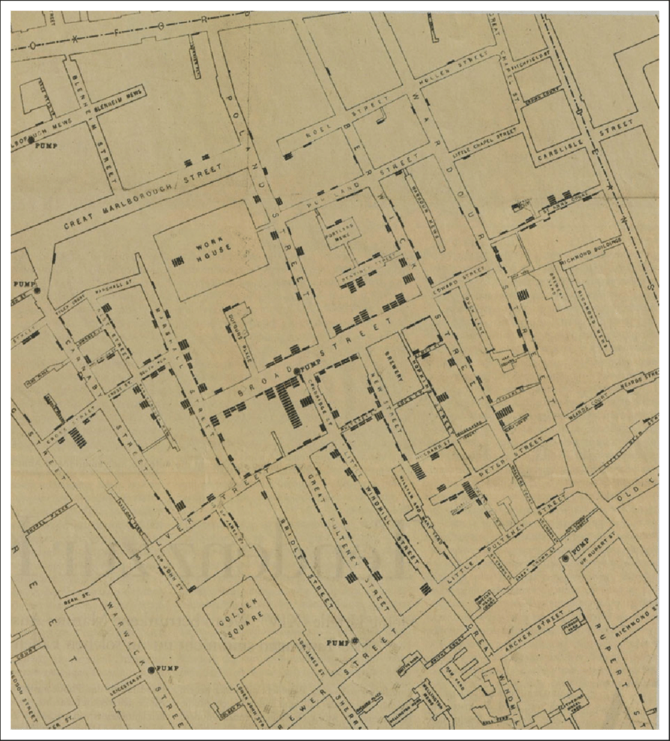

# Graphs in R P.1

### Instructions

Read this tutorial and apply the codes in R.

### Visualization

_“The greatest value of a picture is when it forces us to notice what we never expected to see.”_

— John Tukey

Visualizing data is one of the most important tasks facing the data analyst. It’s important for two distinct but closely related reasons. Firstly, there’s the matter of drawing “presentation graphics”: displaying your data in a clean, visually appealing fashion makes it easier for your reader to understand what you’re trying to tell them. Equally important, perhaps even more important, is the fact that graphs help you understand the data. To that end, it’s important to draw “exploratory graphics” that help you learn about the data as you go about analyzing it.

<figure><figcaption><p>John Snow map with cholera dead entered in bars</p></figcaption></figure>

One of the most famous data visualizations of all time is John Snow’s 1854 map of cholera deaths. The map is elegant in its simplicity. In the background, we have a street map, which helps orient the viewer. Over the top, we see cholera mortality cases entered in bars. Even the most casual inspection of the graph makes it very clear that the outbreak's source is almost certainly the Broad Street pump. Upon viewing this graph, Dr. Snow arranged to have the handle removed from the pump, ending the outbreak that had killed over 500 people. Such is the power of good data visualization.

R doesn’t really provide a single coherent graphics system. Instead, R itself provides a platform, and different people have built different graphical tools using that platform. So let’s start painting.

### Scatter Plot

```r
# Load the matcars dataset in R
mtcars

# Scatter plot using base R
plot(mtcars$wt, mtcars$mpg)

# Scatter plot using ggplot2
library(ggplot2)
ggplot(mtcars, aes(x = wt, y = mpg)) +
  geom_point()
```

 

The figure on the left hand is the scatter plot using the R function `plot()` and the one on the right hand is the result of `ggplot()`.

The first part in `ggplot()` tells R to create a plot object and the second part `geom_point()` tells R to add a layer of points to the plot. The usual way to use `ggplot()` is to pass it a data frame (`mtcars`) and then tell it which columns to use for the x and y values. If you want to pass it two vectors for x and y values, you can use `data = NULL` and then pass the vectors. Keep in mind that ggplot2 is designed to work with data frames as the data source, not individual vectors and that using it this way will only allow you to use a limited part of its capabilities.

### Line Graph

To make a line graph using `plot()` pass it a vector of x values and a vector of y values, and use `type = "l"`. To add points and/or multiple lines, call `plot()` for the first line, and then add points with `points()` and additional lines with `lines()`:

```r
# Load the pressure dataset in R
pressure

# Line plot using base R
plot(pressure$temperature, pressure$pressure, type = "l")

# Line plot using base R with added points and lines
plot(pressure$temperature, pressure$pressure, type = "l")
points(pressure$temperature, pressure$pressure)
lines(pressure$temperature, pressure$pressure/2, col = "red")
points(pressure$temperature, pressure$pressure/2, col = "red")
```

 

With ggplot2, you can get a similar result using `geom_line()` . As with scatter plots, you can pass your data in vectors instead of in a data frame (but this will limit the things you can do later with the plot):

```r
# Line plot using ggplot2
library(ggplot2)
ggplot(pressure, aes(x = temperature, y = pressure)) +
  geom_line()
```

 

### Bar Graph

To make a bar graph of values, use `barplot()` and pass it a vector of values for the height of each bar and (optionally) a vector of labels for each bar. If the vector has names for the elements, the names will automatically be used as labels. Sometimes “bar graph” refers to a graph where the bars represent the _count_ of cases in each category. This is similar to a histogram, but with a discrete instead of a continuous x-axis. To generate the count of each unique value in a vector, use the `table()` function. Then pass the table to `barplot()` to generate the graph of counts.

```r
# Bar plot of data using base R
BOD
barplot(BOD$demand, names.arg = BOD$Time)

# Bar plot of counts using base R
mtcars
table(mtcars$cyl) # Generate a table of counts
##  4  6  8       # There are 11 cases of 4, 7 cases of 6, and 14 cases of 8
## 11  7 14

# Generate a table of counts
barplot(table(mtcars$cyl))
```

 

With ggplot2, you can get a similar result using `geom_col()` . To plot a bar graph of _values_, use `geom_col()`. Notice the difference in the output when the _x_ variable is continuous and when it is discrete:

```r
# Bar plot of data using ggplot2
library(ggplot2)
ggplot(BOD, aes(x = Time, y = demand)) +
  geom_col()

# Convert the x variable to a factor, so that it is treated as discrete
ggplot(BOD, aes(x = factor(Time), y = demand)) +
  geom_col()
```

 

ggplot2 can also be used to plot the _count_ of the number of data rows in each category by using `geom_bar()` instead of `geom_col()`. Once again, notice the difference between a continuous x-axis and a discrete one. For some kinds of data, it may make more sense to convert the continuous x variable to a discrete one, with the `factor()` function.

```
# Bar plot of counts (rows) using ggplot2 (continuous x)
ggplot(mtcars, aes(x = cyl)) +
  geom_bar()

# Bar graph of counts using the factor function (discrete x)
ggplot(mtcars, aes(x = factor(cyl))) +
  geom_bar()
```

 

### Histogram

To make a histogram in base R use `hist()` and pass it a vector of values:

```r
# Histogram of data using base R
hist(mtcars$mpg)

# Specify the approximate number of bins with breaks
hist(mtcars$mpg, breaks = 10)
```

 

With the ggplot2, you can get a similar result using `geom_histogram()` :

```r
# Histogram of data using ggplot2
library(ggplot2)
ggplot(mtcars, aes(x = mpg)) +
  geom_histogram()
  
#> `stat_bin()` using `bins = 30`. Pick better value with `binwidth`.

# With wider bins
ggplot(mtcars, aes(x = mpg)) +
  geom_histogram(binwidth = 4)
```

 

When you create a histogram without specifying the bin width, `ggplot()` prints out a message telling you that it’s defaulting to 30 bins, and to pick a better bin width. This is because it’s important to explore your data using different bin widths. The default of 30 may or may not show you something useful about your data.

### Creating a Box Plot

To make a box plot, use `plot()` and pass it a factor of x values and a vector of y values. When x is a factor (as opposed to a numeric vector), it will automatically create a box plot. If the two vectors are in the same data frame, you can also use the `boxplot()` function with formula syntax. With this syntax, you can combine two variables on the x-axis

```r
# Histogram of data in base R
plot(ToothGrowth$supp, ToothGrowth$len)

# Formula syntax
boxplot(len ~ supp, data = ToothGrowth)

# Put interaction of two variables on x-axis
boxplot(len ~ supp + dose, data = ToothGrowth)
```

<figure><figcaption></figcaption></figure>

With the ggplot2 package, you can get a similar result, with `geom_boxplot()`. It’s also possible to make box plots for multiple variables, by combining the variables with `interaction()`

```r
# Histogram of data with ggplot2
library(ggplot2)

ggplot(ToothGrowth, aes(x = supp, y = len)) +
  geom_boxplot()
  
ggplot(ToothGrowth, aes(x = interaction(supp, dose), y = len)) +
  geom_boxplot()
```


### Plotting a Function Curve

To plot a function curve, use `curve()` and pass it an expression with the variable x. You can plot any function that takes a numeric vector as input and returns a numeric vector, including functions that you define yourself. Using `add = TRUE` will add a curve to the previously created plot.

```r
# Plot a function in base R
curve(x^3 - 5*x, from = -4, to = 4)

# Plot a user-defined function
myfun <- function(xvar) {
  1 / (1 + exp(-xvar + 10))
}
curve(myfun(x), from = 0, to = 20)

# Add a line:
curve(1 - myfun(x), add = TRUE, col = "red")
```


With ggplot2, you can get a similar result by using `stat_function(geom = "line")` and passing it a function that takes a numeric vector as input and returns a numeric vector:

```r
# Plot a function with ggplot2
library(ggplot2)

ggplot(data.frame(x = c(0, 20)), aes(x = x)) +  # This sets the x range from 0 to 20
  stat_function(fun = myfun, geom = "line")
```


